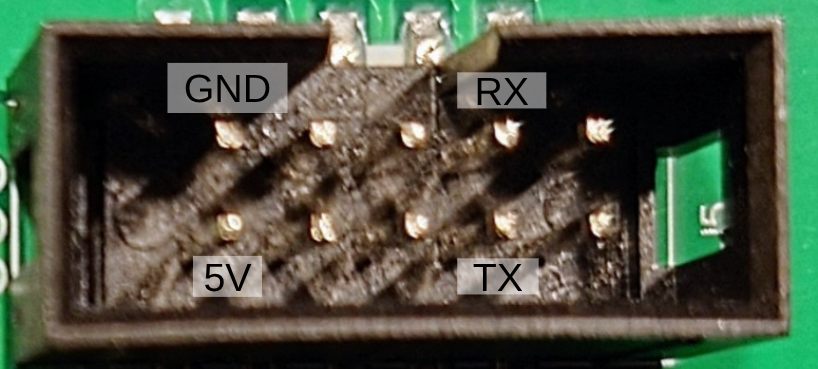
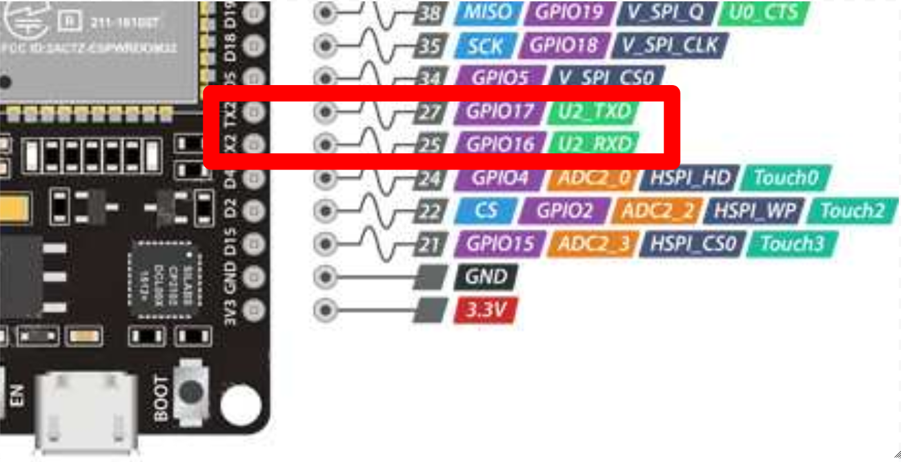

# esp32_dwin
## Introduction
I'd like to be able to interact with Creality Ender 3 v2 screen with an ESP32. This screen is: DMT48270C043_04WNZ11. This is a smart screen which uses a high level protocol. This protocol is described here:
- https://github.com/ihrapsa/T5UIC1-DWIN-toolset/blob/main/T5UIC1.Kernel.Application.Guide-en-v2.3(translated).pdf

I managed to do so using DWIN and using this code: https://github.com/RobRobM/DWIN_T5UIC1_LCD_E3S1

## Wiring
The protocol used by the screen is UART. The screen requires 5V for the power (about 300mA I heard). And two wires for the UART (related to the display). In the future, I'd like to coverte the rotary button as well.

The ESP requires to use GPIO16 and GPIO17: 

